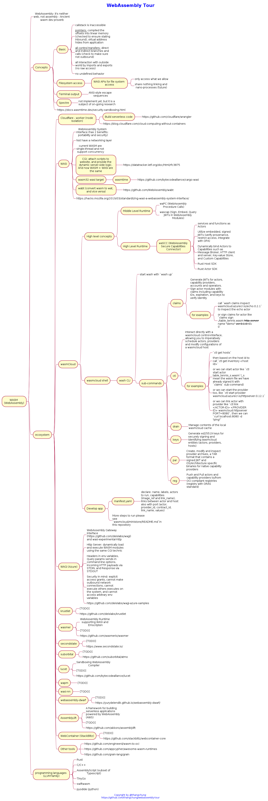

# WebAssembly Tour

WebAssembly on Rust is a bright future in making application runs at the Edge or on the Serverless technologies. 

We spend a lot of time researching and doing a deep dive into it. We have documented it as the [`mindmap`](https://plantuml.com/mindmap-diagram) diagram so that it might help people like me to save time to search around the internet to find useful documents and tools to get started with WebAssembly on Rust.

## Give a Star! ⭐

If you like or are using this project to learn, please give a star. Thank you very much 👍

## The picture of webassembly serverless


## The full picture of WebAssembly ecosystem



## Export large PNG file with PlantUML

Make sure you install https://marketplace.visualstudio.com/items?itemName=jebbs.plantuml and you have `docker` and `docker-compose` running on your local machine.

```bash
$ docker-compose up
```

Then set settings as following

```
"plantuml.server": "http://192.168.1.100:8080",
"plantuml.render": "PlantUMLServer",
```

Then right-click on the `assets/wasm-tour.puml`, then choose expose this current diagram.

# Diagrams
- https://plantuml.com/mindmap-diagram
- https://github.com/plantuml-stdlib/C4-PlantUML/blob/master/samples/C4CoreDiagrams.md